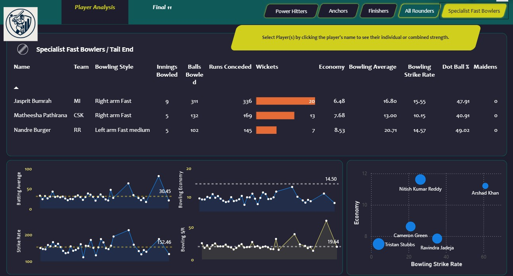
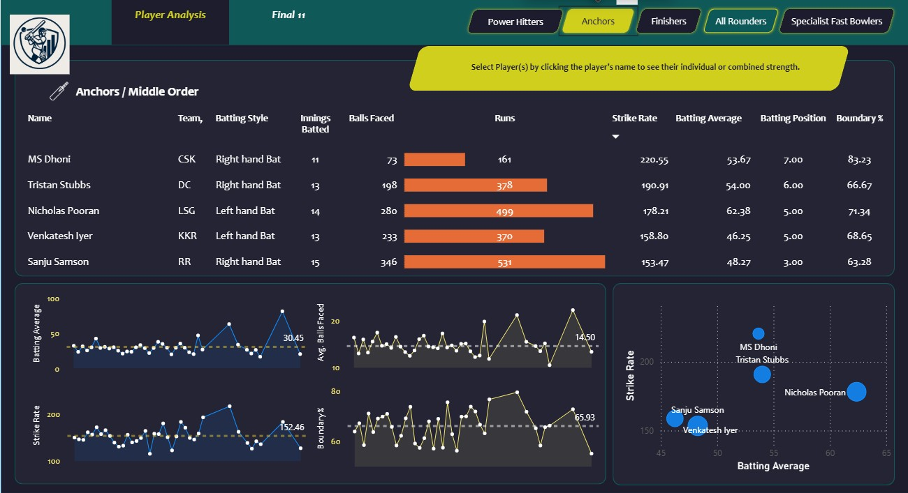

# 🏏 My11-IPLData

**My11-IPLData** is a data analysis project focused on the IPL 2024 season. It uses Bright Data's web scraper to collect player data from **[ESPNcricinfo](https://www.espncricinfo.com/)**, which is then processed using **Python** and visualized in **Power BI**.
The project features interactive dashboards that break down player performances across different roles (e.g., fast bowlers, power hitters, all-rounders) with key metrics like strike rate, economy rate, and batting average. A unique **Top 11 Players Selection Page** allows users to build their ideal team based on performance data.
This project automates the process of evaluating IPL players, providing valuable insights for team selectors and analysts.

---

## 🎯 Problem Solved

The project aimed to simplify player performance evaluation in the IPL by transforming large volumes of unstructured cricket data into actionable insights. Traditionally, selecting top performers across different player roles (openers, middle-order anchors, finishers, bowlers) required manual analysis of scattered statistics. 

This project automated the data collection, processing, and visualization using Power BI and Python, enabling:

- Objective comparison of players based on multi-dimensional metrics (e.g., strike rate, economy, consistency).
- Role-wise identification of top performers using filtered dashboards.
- A “Final 11” recommendation system to suggest the most balanced team composition.
- Visual analysis of trends, performance distributions, and venue/toss impact, supporting more data-driven decisions in team selection and match analysis.

By integrating scraping, ETL, and dynamic visual reporting, the project provided a comprehensive, scalable solution for performance analysis in T20 cricket.

---

## 📊 Project Overview
- **Tech Stacks Used**
  - **Python** – Data preprocessing, cleaning, and transformation  
  - **JavaScript** – Structuring and handling JSON-based cricket data  
  - **Power BI** – Building interactive dashboards and visualizations  
  - **Power Query** – Data import, transformation, and modeling
- **Website Scraped:** [ESPNcricinfo](https://www.espncricinfo.com/)
- **Data Format:** JSON to Excel/CSV (converted for visualization)
- **Focus Areas:**
  - **Fast Bowlers’ Performance**  
     Evaluated using Economy Rate, Bowling Strike Rate, Bowling Average, Dot Ball Percentage, and Wicket Efficiency.
  - **Power Hitters/Openers**  
      Assessed via Strike Rate, Batting Average, Boundary Percentage, Innings Played, and Runs Scored.
  - **Middle-Order Anchors**  
      Analyzed based on Runs Scored, Batting Average, Strike Rate, Boundary Percentage, and Balls Faced.
  - **Lower-Order Finishers/All-Rounders**  
      Judged on both batting (Runs, Average, Strike Rate, Balls Faced) and bowling (Wickets, Economy, Bowling SR, Innings Bowled).
  - **Trendlines**
      Show consistent performance in Batting Average, Strike Rate, Boundary Percentage, Balls Faced, and Bowling SR.
  - **Scatter Plots**  
      Visual analysis of Batting Average vs Strike Rate and Bowling Strike Rate vs Economy.
  - **Key Player Performances**  
      Standout contributions from Stubbs, Green, Pooran, Dhoni, Bumrah, and Pathirana across different roles.
  - **Role-Based Insights**  
      Help in understanding balanced team composition through diverse player contributions.

---
## 🔧 Data Collection Process

The data for the **My11-IPLData** project is collected from **ESPNcricinfo** using **Bright Data’s web scraping tools**. The process involves:
1. **Web Scraping with Bright Data**: A scraper is used to extract comprehensive IPL 2024 player data, including match statistics, batting and bowling performance, and player roles.

2. **Data Points Collected**: Key player metrics such as runs scored, wickets taken, batting average, strike rate, economy rate, and more are gathered for each player across all matches.
3. **JSON to CSV Conversion**: The raw scraped data, initially structured in JSON format, is converted into **CSV/Excel** format for easy handling and analysis.
4. **Data Validation**: The scraped data undergoes validation to check for inconsistencies, missing values, and outliers, ensuring accuracy.
5. **Data Aggregation**: The data is aggregated at both player and match levels, providing a complete view of player performances across the IPL 2024 season.
This process enables the collection of IPL player performance data, providing a solid foundation for analysis and visualization.

---

## 🔍 Key Insights

The **My11-IPLData** project provides several valuable insights into the performance of IPL 2024 players, including:
1. **Top Performers by Role**:
   - **Special Fast Bowlers**: Identifying the most effective fast bowlers based on metrics like economy rate, bowling strike rate, and wicket efficiency.
     
   - **Power Hitters/Openers**: Highlighting players with the highest strike rates and boundary percentages, crucial for setting a strong foundation in the powerplay overs.
     
   - **Middle-Order Anchors**: Recognizing players who provide stability in the middle overs, with high batting averages and consistent scoring.
     
   - **Lower-Order Finishers/All-Rounders**: Pinpointing key players who perform both with bat and ball, contributing significantly to the team's balance and match finish.
     
     
2. **Role-Based Performance Comparisons**:
   - Objective comparisons between players in similar roles, helping to identify who is outshining others in specific areas like batting strike rate, economy rate, and consistency.
3. **Top 11 Players**:
   - A tool for selecting the **ideal team** based on performance metrics, helping to assemble a balanced team from top performers across different player roles.
4. **Performance Trends**:
   - Analysis of trends, such as improvements in batting strike rates or bowlers' economy rates over the season, revealing how players have adapted and evolved throughout the tournament.
5. **Player Consistency**:
   - Identifying players who maintain consistent high performance across multiple matches, offering insight into reliability and value over a tournament.
6. **Top Players in Key Metrics**:
   - Standout players such as **Stubbs**, **Green**, **Pooran**, **Dhoni**, **Bumrah**, and **Pathirana** who excel in specific metrics, providing insight into the most impactful players in each role.

These insights make it easier to analyze and compare players based on data-driven metrics, aiding in team selection, strategic planning, and performance evaluation.

---
## 🎨 Visualizations

The **My11-IPLData** dashboard leverages several types of visualizations in Power BI to present IPL player performance data effectively. These visualizations allow for easy comparisons and insights across various player roles and performance metrics:
1. **Bar Charts**:
   - Used to compare the performance of players in specific roles, such as **special fast bowlers** or **power hitters**, based on key metrics like **strike rate**, **economy rate**, and **batting average**.
   - Bar charts provide a clear view of how each player stacks up against others in their respective categories.
2. **Scatter Plots**:
   - Visualize the relationship between different performance metrics, such as **batting average vs. strike rate** or **bowling strike rate vs. economy rate**.
   - These plots highlight correlations and help identify players who maintain a good balance between multiple key metrics.
3. **Line Graphs**:
   - Track the trends in **batting strike rate**, **economy rate**, or **wicket efficiency** over the course of the IPL 2024 season.
   - These graphs highlight the evolution of player performance and reveal any patterns or fluctuations across different phases of the tournament.
4. **Top 11 Players Selection Page**:
   - A dynamic visualization that helps users create their **ideal IPL team** by selecting top players across various roles and comparing them based on performance metrics.

These visualizations help users navigate the data with ease and provide actionable insights, facilitating more informed decisions in team selection and performance analysis.

---

## 👨‍💻 Created By

**Dipanshu Modi**  
B.Tech Computer Science, KIIT University
